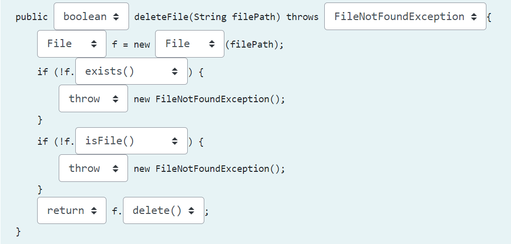

# Лаб 1
## Зад 1.
Допишете ги имињата на класите и методите кои недостасуваат за да го имплементирате следното сценарио. Напомена: Сите класи и методи се дел од библиотеката java.io.

Избришете ја датотеката чија патека се наоѓа во променливата filePath. 

Fill in the appropriate names of the missing classes or methods to implement the following scenario:

Delete the file whose file path is specified in the variable filePath.

## Зад 2.
Допишете ги имињата на класите и методите кои недостасуваат за да го имплементирате следното сценарио. Напомена: Сите класи и методи се дел од библиотеката java.io.

Исфилтрирајте ги сите подименици кои го содржат зборот finki во своето име, во директориумот чија патека се наоѓа во променливата filePath (само прво ниво без да влегувате во подименици). Резултатот прикажете го на стандарден излез.

Fill in the appropriate names of the missing classes or methods to implement the following scenario:

Filter all sub-directories placed in the directory whose path is specified by the variable filePath, which contain the word “finki” in their name (only first level, without entering into sub-directories). Print the result to the standard output.

## Зад 3.
Пронајдете го најголемиот документ во директориумот чија патека се наоѓа во filePath.  Резултатот прикажете го на стандарден излез. 
Користете ги готовите класи од библиотеката Java IO. Целосното решение (Java кодот) на задачата внесете го како одговор.

Filter the largest file in directory whose path is referred by the variable filePath. Print the result to the standard output. 
Use the standard classes from the Java IO library. Enter the complete code solution (Java code) of the task in the response field.

[Zadaca3.java](zadaca3.java)

## Зад 4.
Напишете Java програма која рекурзивно ги изменува сите документи во даден именик и неговото поддрво, и ги пребарува сите `.txt` или `.out` документи кои се поголеми од 1KB, a помали од 100KB. Патеката на директориумот ја прима како влезен аргумент од командна линија. Апсолутната патека, на документот кој го задоволува условот, ја печати  на екран.

Решение: Решението (JAVA кодот) го поставувате тука со copy-paste.

Write basic Java application which traverses all documents in a given directory and its subtree, and searches for files with ‘.txt’ or ‘.out’ extension larger than 1KB and smaller than 100KB. The path of the directory is passed as program argument.  Print the absolute path of the files which meet the requirements.

Solution: The solution (Java code) should be placed here, using copy-paste.

[Zadaca4.java](zadaca4.java)

## Зад 5.
Допишете ги имињата на класите и методите кои недостасуваат за да го имплементирате следното сценарио.
Исчитајте содржина од стандарден влез и запишете ја во документ чија патека е специфицирана во влезниот аргумент outputFilePath.
Напомена: Сите класи и методи се дел од библиотеката java.io.

Fill in the appropriate names of the missing classes or methods to implement the following scenario:
Read content from standard input and write it out to the file whose path is specified by the variable outputFilePath.

## Зад 6.
Да се напише Java програма која со користење на I/O стримови ќе ја прочита содржината на датотеката izvor.txt, а потоа нејзината содржина ќе ја испише превртена во празната датотека destinacija.txt. Читањето и запишувањето реализирајте го со баферирано читање и запишување Пример:

izvor.txt                   destinacija.txt

Оперативни системи          иметсис инвитарепО
Напомена: Сами креирајте ги овие две датотеки и пополнете ја izvor.txt со произволна содржина.

Решение: Решението од .java фајлот го поставувате тука со copy-paste

Write a Java program which will use I/O streams to read the content of the file source.txt, and then write out its content in a reverse order to the empty file destination.txt. The read and write should be done using buffered streams.

Example:

source.txt                  destination.txt

Operating Systems           smetsyS gnitarepO
Note: You should create these two files yourself and fill izvor.txt with some arbitrary content.

Solution: The .java file should be placed here, using copy-paste.

[Zadaca6.java](zadaca6.java)