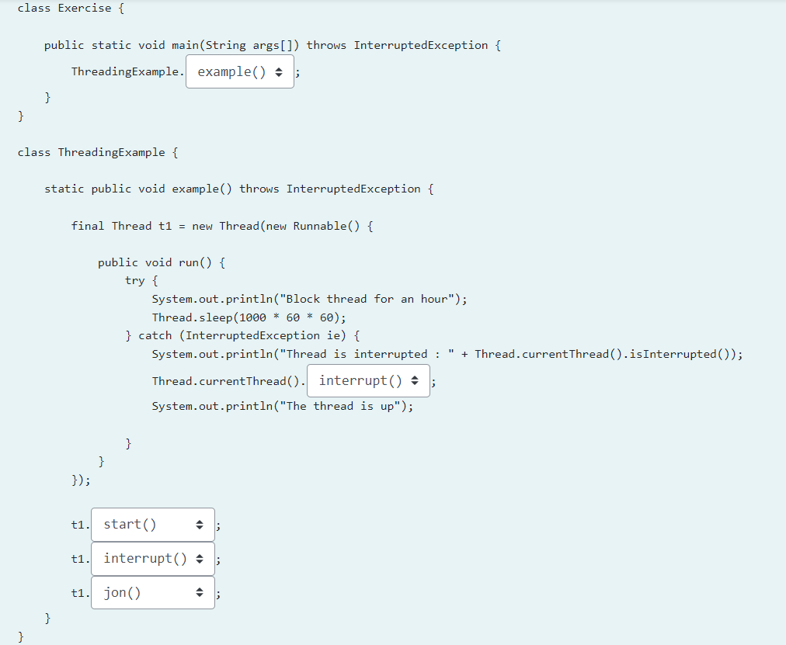

# Лаб 2
## Зад 1.
Извршете го примерот од TwoThreads. Потоа, модифицирајте ја програмата така што ќе користите само една класа за нитки, ThreadClassLettersNumbers. Во конструкторот на класата ќе се предадe листа која соодветната инстанца треба да ја отпечати. Нитката не треба да ја наследува класата Thread. Однесувањето на новата програма треба да биде исто како на оригиналната, односно повторно треба да имате две нитки кои ќе го извршуваат посебно методот run(): едната нитка ќе ги печати првите десет букви од англиската азбука, потоа другата ќе ги печати првите десет броеви.


Execute the TwoThreads example. Then modify the program so that it uses only one thread class, ThreadClassLettersNumbers. In the constructor of the class you should pass the list which should be printed by the corresponding instance. The thread should not inherit from the Thread class. The new program should behave the same way as the original one, i.e. you must have two threads again which will separately execute the run() method: one thread will print the first ten letters from the english alphabetic , than the other one will print the first ten numbers.

```
public class TwoThreads {


public static void main(String[] args) throws InterruptedException {
    ThreadClassLetters letters = new ThreadClassLetters();
    ThreadClassNumbers numbers = new ThreadClassNumbers();
    letters.start();
    letters.join();
    numbers.start();
    numbers.join();
}


}

class ThreadClassNumbers extends Thread {

    @Override
    public void run() {
        for(int i = 0; i<10;i++) System.out.println(i);
    }
}


class ThreadClassLetters extends Thread {

    @Override
    public void run() {
        for(int i = 0; i<10;i++) System.out.println((char)(i + 65));
    }
}
```

[TwoThreads.java](TwoThreads.java)

## Зад 2.
Со помош на синхронизациските методи да се реши проблемот за определување на бројот на појавувања на буквата E во  стрингот и негово запишување во глобална променлива count.

Секвенцијалното решение не е прифатливо поради тоа што трае многу долго време (поради големината на стрингот). За таа цел, потребно е да се паралелизира овој процес, при што треба да се напише метода која ќе ги брои појавувањата на буквата E во помал фрагмент од стрингот, при што резултатот повторно се чува во глобалната заедничка променлива count.

Напомена: Почетниот код е даден во почетниот код CountLetter. Задачата да се тестира над стринг од минимум 1000 карактери.


Solve the issue of detecting the number of occurrences of the letter E in a large array by using thread synchronization methods. The counts are written / incremented in the global variable count on each find.

The standard sequential solution is not acceptable as it takes a long time (because the string is very large). Therefore, you need to implement this process and write a method which will count the occurrences of letter E in smaller fragments of the string, while the result is still kept in the global count variable.

Note: The starting code for the solutions is given in CountLetter. You need to test it with an array of at least 1.000 elements.

```
public class CountLetter {

    /**
     * Promenlivata koja treba da go sodrzi brojot na pojavuvanja na bukvata A
     */
    int count = 0;
    /**
     * TODO: definirajte gi potrebnite elementi za sinhronizacija
     */

    public void init() {
    }

    class Counter extends Thread {

        public void count(String data) throws InterruptedException {
            // da se implementira
        }
        private String data;

        public Counter(String data) {
            this.data = data;
        }

        @Override
        public void run() {
            try {
                count(data);
            } catch (Exception e) {
                e.printStackTrace();
            }
        }
    }

    public static void main(String[] args) {
        try {
            CountLetter environment = new CountLetter();
            environment.start();
        } catch (Exception ex) {
            ex.printStackTrace();
        }
    }

    public void start() throws Exception {

        init();

        HashSet<Thread> threads = new HashSet<Thread>();
        BufferedReader bf = new BufferedReader(new InputStreamReader(System.in));

        String pom = bf.readLine();
        String [] data = pom.split("");
        
        for(int i = 0; i< data.length; i++) {
            
            Counter c = new Counter(data[i]);
            threads.add(c);
        }


        for (Thread t : threads) {
            t.start();
        }

        for (Thread t : threads) {
            t.join();
        }
        System.out.println(count);


    }
}
```

[CountLetter.java](CountLetter.java)

## Зад 3.
Симулирајте сценарио каде повеќе нишки истовремено додаваат и одземаат елементи од една инстанца од типот BlockingQueue. Синхронизирајте го пристапот до enqueue и dequeue со користење на синхронизациски механизам со помош на Семафори.

Simulate a scenario where multiple concurrent threads enqueue and dequeue elements from one instance of the type BlockingQueue. Synchronize the access to enqueue and dequeue using a synchronization mechanism with the help of Semaphores.


```
public class BlockingQueue<T> {
 
    T[] contents;
    int capacity;
 
    public BlockingQueue(int capacity) {
        contents = (T[]) new Object[capacity];
        this.capacity = capacity;
    }
 
    public void enqueue(T item) {
    }
 
    public T dequeue() {
    }
}
```

[QueueTest.java](QueueTest.java)

## Зад 4.
Во дадениот код, изберете соодветна опција за стартување на нова нишка (која ќе биде во блокирана состојба за 1 час - Thread.sleep(ms). Изберете соодветни опции за насилно прекинување на нишката и чекање да заврши.

In the given code, pick the right option to start a new thread (that will be blocked for 1 hour - Thread.sleep(ms). Choose the right options for interrupting the thread and waiting for it to finish.



## Зад 5.
Која ќе биде вредноста на променливата count која ќе се испечати во дадениот код?

In the following code, what value of count variable is going to be printed?


```
public class Example{
    public static void main() {

            ThreadClass thread = new ThreadClass();
            thread.start();
            thread.join();
            System.out.println(thread.getCount());
    }
}

class ThreadClass extends Thread{
    static int count = 0;
    public void increment() {
        count++;
    }
    public int getCount(){
        return count;
    }

    @Override
    public void run() {
        for(int i = 0; i < 50; i++)
            increment();
    }
}

```
Select one:

- [ ] a.
печати 0 како вредност на count променливата
prints 0 as value of the count variable
- [x] b.
печати 50 како вредност на count променливата
prints 50 as value of the count variable

Објаснување: Бидејќи се повикува .join() сигурно ќе зе изврши тредот до крај и ќе се добие 50. Ако немаше .join(),
највероатно ќе беше 0, но може да се добие било кој број 0<=n<=50.