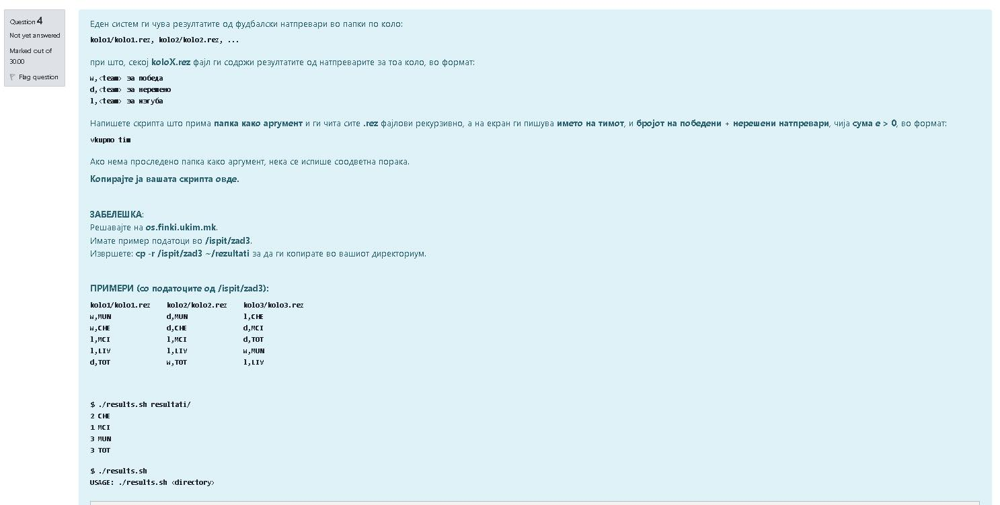
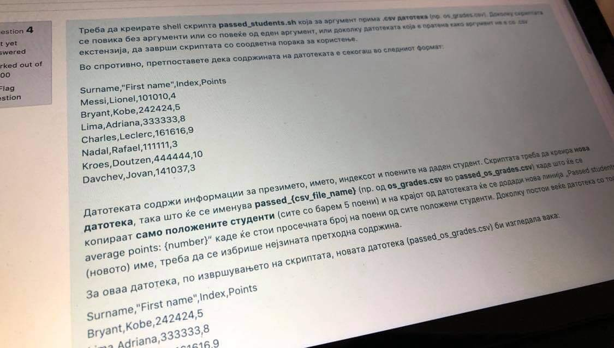
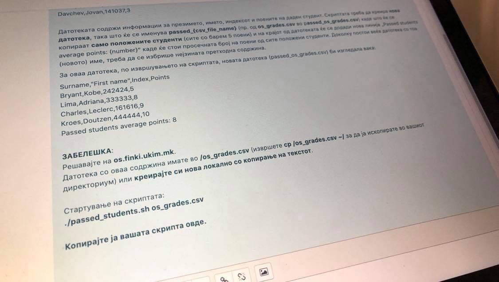
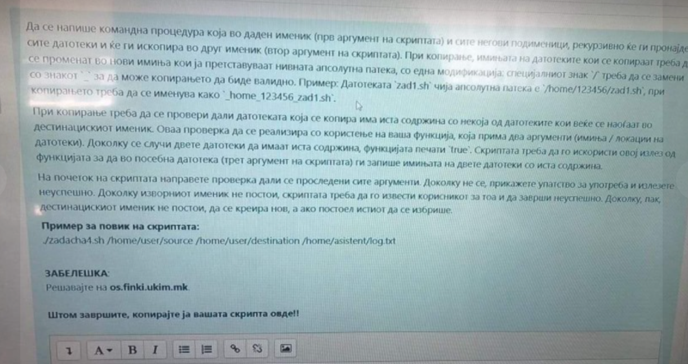
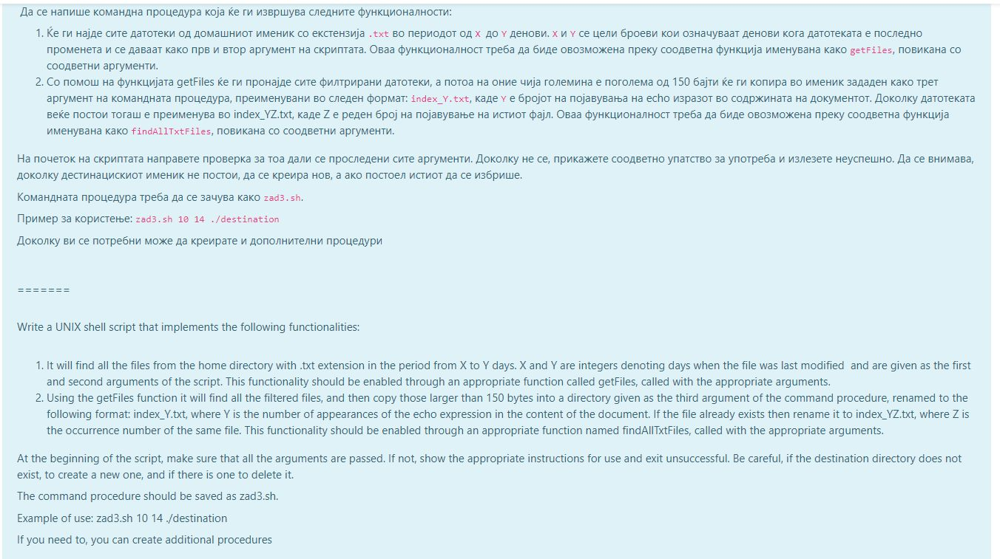
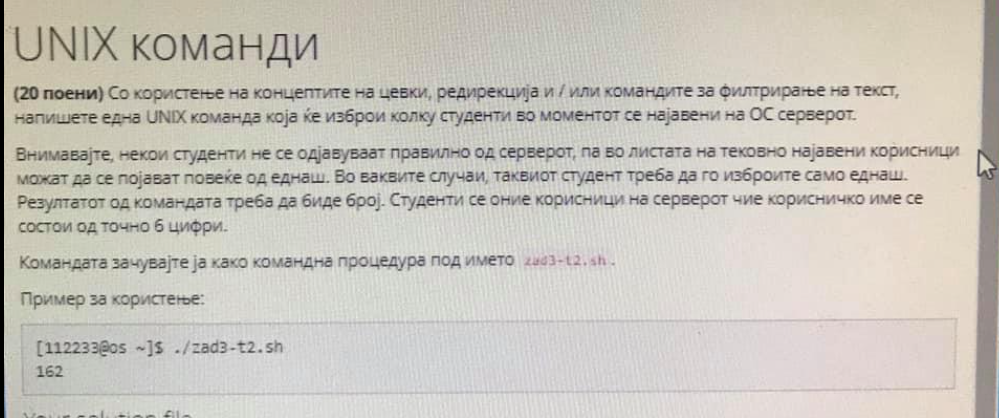
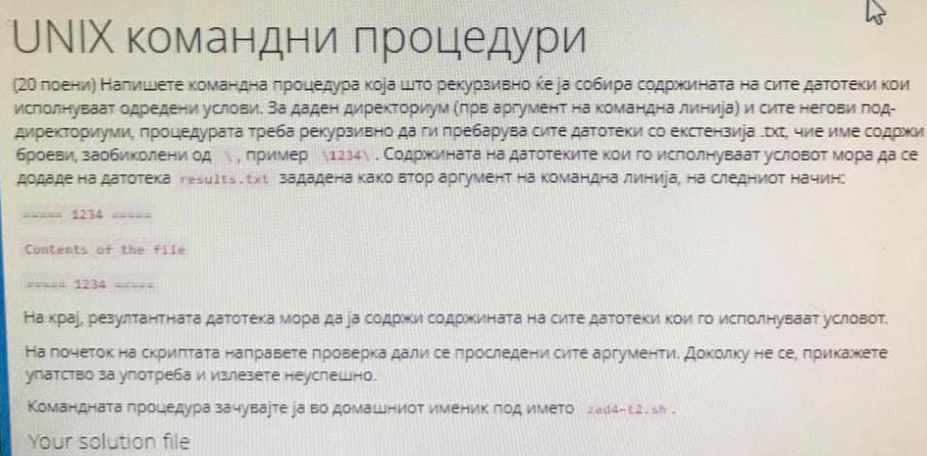

# Задачи за вежбање

## 1. 

[zad1.sh](zad1.sh)

## 2. 

[zad2.sh](zad2.sh)

## 3.

[zad3.sh](zad3.sh)

## 4.

[zad4.sh](zad4.sh)

## 5.

`who | awk '{print $1}' | uniq | wc -l`

## 6.

[zad6.sh](zad6.sh)

## Кратки команди
1. Со користење на концептите на цевки, редирекција и/или командите за филтрирање на текст, напишете ЕДНА UNIX команда која ќе ја пронајде најдолготрајната сесија од претходно најавен корисник, која сега е завршена. Командата треба да ги отпечати времето на траење на сесијата и корисничкото име на најавениот корисник (пр. 05:36 112111) . Доколку повеќе SSH сесии го исполнуваат критериумот, доволно е да се испечати само една.

    `last | awk '{print $10,$1}' | sort -r | grep '^(' | sed 's/(//' |sed 's/)//' | head -1`

2. Со користење на концептите на цевки, редирекција и/или командите за филтрирање на текст да се напише команда која ќе испечати листа на корисничките имиња на оние корисници кои се најавувале на системот за викенд и сесијата им траела повеќе од 2 часа. Листата треба да содржи две колони, сортирани по растечки редослед според бројот на индекс, без дупликати, одделени со tab. Потоа избројте колку има вакви студенти и во истата команда додадете ја листата и бројот во list.txt

    `last | grep -E 'Sat|Sun' | grep '([0-9][2-9]:[0-9][0-9])' | sort | uniq | awk '{printf "%s\t%s\n",$1,$10}'`

3. Со користење на концептите на цевки, редирекција и/или командите за филтрирање на текст да се напише команда која ќе ги излиста сите датотеки чие име има повеќе од 5 карактери, каде крајниот е c, а содржат и точка (.) (пр. zad1.c, .javac)

    `ls | grep '\.' |grep '.\{4,\}c$'`

4. Со користење на концептите на цевки, редирекција и/или командите за филтрирање на текст да се напише команда која ќе ги изброи сите индекси на студенти логирани на ОС серверот на вчерашниот ден помеѓу 10 и 13 часот, без дупликати, подредени во опаѓачки редослед

5. Колку студенти се во моментов најавени на серверот, може да има дупликати ради неправилно најавување(во ваков случај број еднаш).

    `last | awk '{print $1;}' | uniq`

6. Изброј колку студенти во моментов работат во nano(имаат активен nano процес).

    ` ps -ef | awk '{print $1,$8;}' | grep 'bash' | awk '{print $1}' | uniq | wc -l`

7. Со користење на концептите на цевки, редирекција и / или командите за филтрирање на текст, напишете ги следниве команди во UNIX:
 
    - (7 поени) Да се напише една команда со која ќе се отпечатат деталите за ваши процеси на ОС серверот (процеси стартувани од вас / вашата корисничка сметка). Командата да се зачува како командна процедура под името zad3а-t2.sh.
        `ps -ef | grep '^206033'`
    - (8 поени) Да се напише една команда со која ќе се отпечати подредена листа на IP адреси (без дупликати) од кои се најавувале корисници на ОС серверот во текот на вчерашниот ден. Командата да се зачува како командна процедура под името zad3b-t2.sh.

8. Да се напише една команда во која со користење на листата на тековно најавени корисници на ОС серверот, ќе се отпечати вашата IP адреса.
    `who | grep '^206033' | awk '{print $5;}' | sed 's/)//' | sed 's/(//'`
