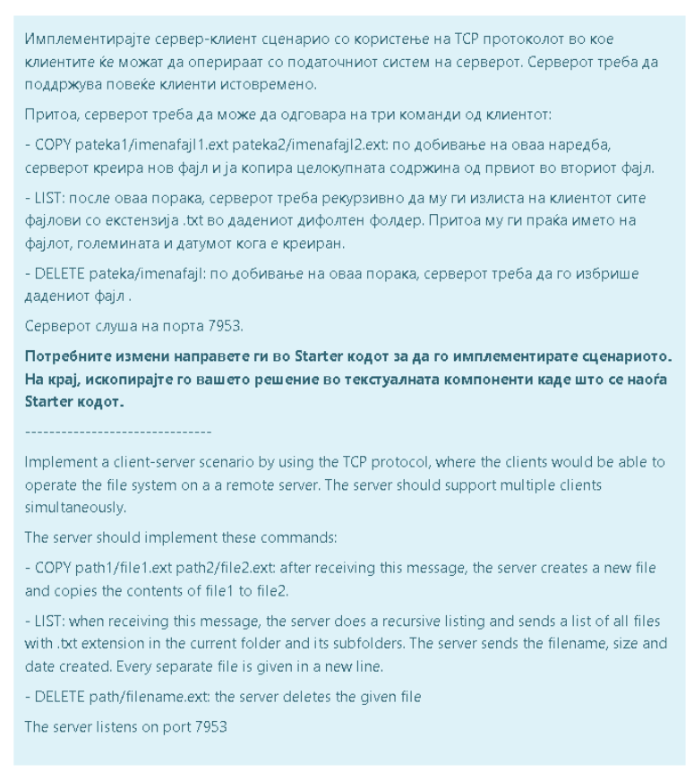

# Задачи за вежбање
### Задача 1 - [Решение](Zadaca1.java)
```
First partial exam (Group 1) Problem 1 (0 / 0)

Using Java I/O, implement the following methods of the ExamIO class:

(10 points) moveWritableTxtFiles(String from, String to)
    Moves all files with the .txt extension which have writing permissions, from the from directory, to the to directory. If the from directory does not exist you should write "Does not exist", and if the to directory does not exist you need to create it.

(10 points) void deserializeData(String source, List<byte[]> data, long elementLength)
    Reads the content of the source file, which contains a large amount of data, all in the same length in bytes, without a delimiter. Each of the data elements has a length of elementLength. The data read should be written in the data list, using data.add(readElement).

(Bonus 5 points) void invertLargeFile(String source, String destination)
    The content of the source file is written in a reverse order (char by char) into the destination file. The source file content is too large and cannot be fitted into memory.
```                        

### Задача 2 - [Решение](Zadaca2.java)


### Задача 3 - [Решение](ZadacaV3.java)        
                         