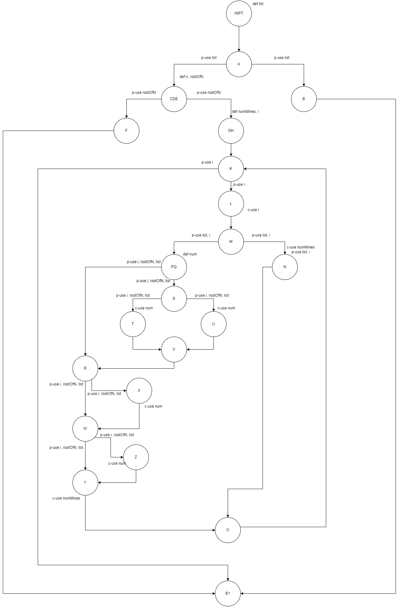

# СИ лаб 2
### Control flow graph


### Цикломатска комплексност - 9
E - N + 2 = 29 - 22 + 2 = 9
- 22 - јазли
- 29 - ребра

### Тест случаи
#### Every statement
| C0      | [] | [0,0,0] | [#,#,0,#,0,#,0,#,0]
| :---------- | ----------- | ----------- | ----------- |
| INPT| * | * | * |
| A   | * | * | * |
| B   | * |   |   |
| C   |   | * | * |
| D   |   | * | * |
| E   |   | * | * |
| F   |   | * |   |
| G   |   |   | * |
| H   |   |   | * |
| K   |   |   | * |
| L   |   |   | * |
| M   |   |   | * |
| N   |   |   | * |
| P   |   |   | * |
| Q   |   |   | * |
| R   |   |   | * |
| S   |   |   | * |
| T   |   |   | * |
| U   |   |   | * |
| V   |   |   | * |
| W   |   |   | * |
| X   |   |   | * |
| Y   |   |   | * |
| Z   |   |   | * |
| B1  | * | * | * |

- Првите два тест случаи одговараат на Exceptions
- Последниот тест случај во првата редица има 0 на почеток и # на 2ра и 3та позиција за да го натера алгоритмот да влезе во Т (num+=1), во втората има 0 во централна позиција опколена со # за да влезе во U (num+=2) и над и под таа 0 има # за да се исполнат посебните услови за над и под 
#### Every branch
| C1      | [] | [0,0,0] | [#,#,0,#,0,#,0,#,0] | [0,0,0,0,0,0,0,0,0] |
| :---------- | ---------- | ---------- | ---------- | ---------- |
| INPT-A | * | * | * | * |
| A-B    | * |   |   |   |
| B-B1   | * |   |   |   |
| A-CDE  |   | * | * | * |
| CDE-F  |   | * |   |   |
| F - B1 |   | * |   |   |
| CDE-GH |   |   | * | * |
| GH-K   |   |   | * | * |
| K-L    |   |   | * | * |
| L-M    |   |   | * | * |
| M-N    |   |   | * |   |
| N-O    |   |   | * |   |
| M-PQ   |   |   | * | * |
| PQ-S   |   |   | * |   |
| PQ-R   |   |   |   | * |
| S-T    |   |   | * |   |
| S-U    |   |   | * |   |
| T-V    |   |   | * |   |
| U-V    |   |   | * |   |
| V-R    |   |   | * |   |
| R-X    |   |   | * |   |
| R-W    |   |   | * | * |
| X-W    |   |   | * |   |
| W-Z    |   |   | * |   |
| W-Y    |   |   | * | * |
| Z-Y    |   |   | * |   |
| Y-O    |   |   | * | * |
| O-K    |   |   | * | * |
| K-B1   |   |   | * | * |
- Првите два исто како C0
- Третото не го исполнува PQ-R за што треба цела празна редица, затоа е додаден 4ти случај

### Тестови
```
public class SILab2Test {
    @Test
    public void statementsTest() {
        IllegalArgumentException ex = assertThrows(IllegalArgumentException.class, () -> SILab2.function(new LinkedList<>()));
        assertTrue(ex.getMessage().contains("greater than 0"));
        ex = assertThrows(IllegalArgumentException.class, () -> SILab2.function(Arrays.asList(new String[]{"0", "0", "0"})));
        assertTrue(ex.getMessage().contains("perfect square"));
        assertEquals(Arrays.asList(new String[]{"#","#","2","#","4","#","2","#","2"}),SILab2.function(Arrays.asList(new String[]{"#","#","0","#","0","#","0","#","0"})));
    }

    @Test
    public void branchesTest() {
        IllegalArgumentException ex = assertThrows(IllegalArgumentException.class, () -> SILab2.function(new LinkedList<>()));
        assertTrue(ex.getMessage().contains("greater than 0"));
        ex = assertThrows(IllegalArgumentException.class, () -> SILab2.function(Arrays.asList(new String[]{"0", "0", "0"})));
        assertTrue(ex.getMessage().contains("perfect square"));
        assertEquals(Arrays.asList(new String[]{"#","#","2","#","4","#","2","#","2"}),SILab2.function(Arrays.asList(new String[]{"#","#","0","#","0","#","0","#","0"})));
        assertEquals(Arrays.asList(new String[]{"0","0","0","0","0","0","0","0","0"}),SILab2.function(Arrays.asList(new String[]{"0","0","0","0","0","0","0","0","0"})));
    }
}
```