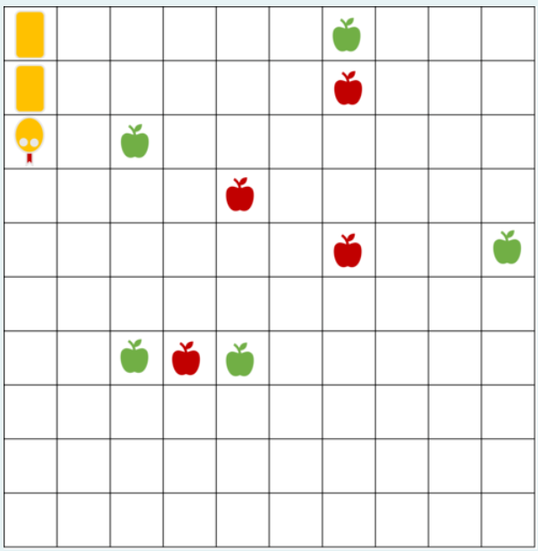
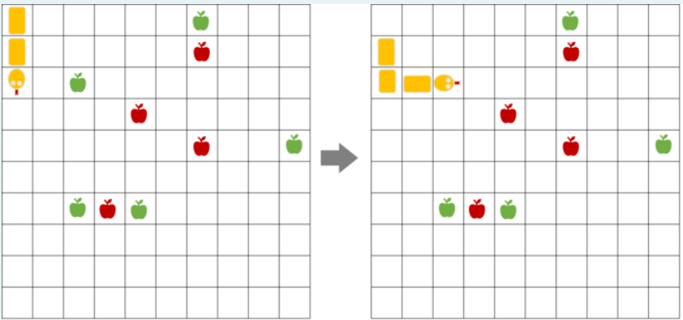

Предложете соодветна репрезентација и напишете ги потребните функции во Python за да се реши следниот проблем за кој една можна почетна состојба е прикажана на Слика 1:

Слика 1:

„Во табла со димензии 10x10 се наоѓаат змија, зелени јаболки и црвени јаболки. Потребно е змијата да ги изеде зелените јаболки, а да ги одбегнува црвените јаболки кои се отровни. Змијата на почетокот зафаќа три полиња од таблата, едно поле за главата и две полиња за телото. При секое јадење на зелена јаболка телото на змијата се издолжува на крајот за едно поле (пример Слика 2). Во даден момент можни се три акции на движење на змијата: продолжи право, сврти лево и сврти десно. При движењето на змијата треба да се внимава змијата да не се изеде сама себе (колизија на главата на змијата со некој дел од телото) и да не излезе надвор од таблата. Потребно е проблемот да се реши во најмал број на потези.“

Слика 2:

За сите тест примери изгледот и големината на таблата се исти како на примерот даден на сликата. За сите тест примери почетната позиција на змијата е иста. За секој тест пример се менува бројот и почетната позиција на зелените и црвените јаболки.

Во рамки на почетниот код даден за задачата се вчитуваат влезните аргументи за секој тест пример. Во променливата crveni_jabolki се сочувани позициите на црвените јаболки (како листа од торки), а во променливата zeleni_jabolki се сочувани позициите на зелените јаболки. Табелата се претставува како координатен систем со координати x и y почнувајќи од нула, па соодветно, позициите се зададени како торка со прв елемент x и втор елемент y.

Движењата на змијата треба да ги именувате на следниот начин:

ProdolzhiPravo - змијата се придвижува за едно поле нанапред
SvrtiDesno - змијата се придвижува за едно поле на десно
SvrtiLevo - змијата се придвижува за едно поле на лево
Вашиот код треба да има само еден повик на функција за приказ на стандарден излез (print) со кој ќе ја вратите секвенцата на движења која змијата треба да ја направи за да може да ги изеде сите зелени јаболки. Да се најде решението со најмал број на преземени акции употребувајќи некој алгоритам за неинформирано пребарување. Врз основа на тест примерите треба самите да определите кое пребарување ќе го користите.