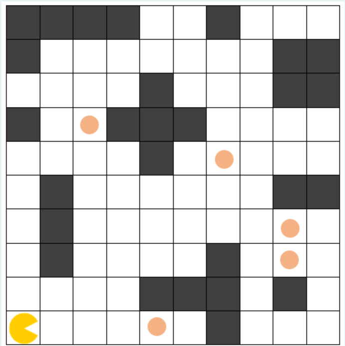

# Задача 1
Предложете соодветна репрезентација на играта Pacman и напишете ги потребните функции во Python за да се реши следниот проблем за кој една можна почетна состојба е прикажана на Слика 1:

"Во табла со димензии 10x10 се наоѓа човече. Човечето може да се придвижува на кое било соседно поле хоризонтално или вертикално, доколку на соодветната позиција не постои пречка. Потребно е човечето да ги изеде сите точки поставени во таблата. Во даден момент можни се четири акции на движење на човечето: продолжи право, продолжи назад, сврти лево и сврти десно. На Слика 2 се прикажани можните движења на човечето за две насоки, каде што со сина боја е обележана новата позиција добиена со акцијата продолжи право, продолжи назад со црвена боја, сврти лево со сива боја и сврти десно со зелена боја. Потребно е проблемот да се реши во најмал број на потези."

За сите тест примери изгледот и големината на таблата се исти како на примерот даден на Слика 1. За сите тест примери позициите на пречките се исти. За секој тест пример почетната позиција на човечето се менува, а исто така се менуваат и позиците на точките.

Од стандарден влез се читаат почетните x и y координати во кои на почетокот се наоѓа човечето (ако таблата ја гледате во стандардниот координатен систем). Следно се чита насоката кон која е поставен играчот ('istok', 'zapad', 'sever', 'jug'). Потоа се чита број на точки во таблата, по што во секој нов ред се читаат x и y координатите на точките во таблата (ако таблата ја гледате во стандардниот координатен систем).

Движењата на човечето потребно е да ги именувате на следниот начин:

- ProdolzhiPravo - за придвижување на човечето за едно поле нанапред
- ProdolzhiNazad - за придвижување на човечето за едно поле наназад
- SvrtiLevo - за придвижување на човечето за едно поле налево
- SvrtiDesno - за придвижување на човечето за едно поле надесно

Вашиот код треба да има само еден повик на функција за приказ на стандарден излез (print) со кој ќе ја вратите секвенцата на движења која човечето треба да ја направи за да може од својата почетна позиција да стигне до позицијата на куќичката. Треба да примените неинформирано пребарување. Врз основа на тест примерите треба самите да определите кое пребарување ќе го користите.

НАПОМЕНА: Подреденоста на акциите во successor функција е важна кај неинформирано пребарување. Соодветно, за да се добие решението кое се очекува во изгенерираните излези, редоследот треба да биде ProdolzhiPravo, ProdolzhiNazad, SvrtiLevo, SvrtiDesno. Доколку акциите не се подредени со истиот редослед, можно е да се најде исто оптимално решение со различна патека.

