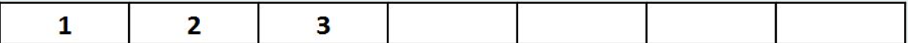

Предложете соодветна репрезентација и напишете ги потребните функции во Python за да се реши следниот проблем за кој една можна почетна состојба е прикажана на Слика 1.

“На една лента составена од L полиња поставени се N дискови (N < L). Дисковите се меѓусебно различни и се нумерирани со целите броеви од 1 до N. На почетокот, дисковите се позиционирани во првите N полиња од лентата (гледајќи одлево - надесно), подредени во растечки редослед според нивните редни броеви (Слика 1 - почетна состојба за N = 3 и L = 7). Потребно е дисковите да се доведат на крајот на лентата (во последните N полиња од лентата, гледајќи одлево - надесно), при што ќе бидат подредени во опаѓачки редослед според нивните редни броеви (како пример, на Слика 2 е прикажана целната состојба која што соодветствува на почетната состојба прикажана на Слика 1). Во еден потег, еден диск може да се премести од полето во кое се наоѓа во соседно празно поле (лево или десно). Исто така, диск може да се премести и од полето во кое се наоѓа -> преку едно поле (во лево или десно), но само ако притоа „прескокнатото“ поле содржи друг диск (на пример, може да се премести диск од првото во третото поле само ако третото поле е празно и второто поле содржи друг диск!). Не е дозволено дисковите да излегуваат од лентата. Потребно е проблемот да се реши во најмал број на потези.”

За сите тест примери изгледот на лентата е ист како на примерот даден на сликите. За сите тест примери распоредот на дисковите на почетокот е ист (како што беше објаснето погоре). За секој тест пример се менува бројот на дискови, а исто така се менува и димензијата на лентата.

Од стандарден влез се вчитуваат влезните аргументи за секој тест пример. Најпрво е даден бројот на дискови (N), а потоа се чита димензијата на лентата (бројот на полиња од кои што е составена истата, L).

Движењата на дисковите потребно е да ги именувате на следниот начин:

D1: Disk i - за преместување на дискот i надесно во соседно празно поле, i = 1, 2, ..., N
D2: Disk i - за преместување на дискот i преку едно поле надесно, i = 1, 2, ..., N
L1: Disk i - за преместување на дискот i налево во соседно празно поле, i = 1, 2, ..., N
L2: Disk i - за преместување на дискот i преку едно поле налево, i = 1, 2, ..., N

Вашиот код треба да има само еден повик на функција за приказ на стандарден излез (print) со кој ќе ја вратите секвенцата на движења која треба да се направи за да може дисковите да се доведат на бараните позиции. Треба да примените информирано пребарување. Дефинирајте прифатлива хевристичка функција за информираниот алгоритам.

Напомена: За различна хевристичка функција може да добиете различно оптимално решение кое не секогаш се поклопува со тест примерите.

Слика 1:

Слика 2:

