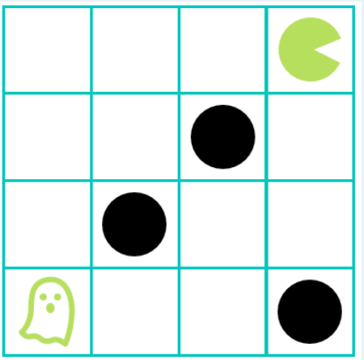

Даден е лавиринт NxN во кој се движи Дух на ролери. Во лавиринтот има ѕидови кои се поставени на случајни позиции и истите може да се прескокнуваат. Потребно е Духот да стигне до Пакман без притоа да удри во некој ѕид или да излезе надвор од лавиринтот. Духот се движи со помош на ролери во две насоки: горе и десно. Со еден потег Духот може да се помести за една, две или три позиции горе или десно. Пример за почетна состојба е прикажан на следната слика:

За сите тест примери големината на таблата n се чита од стандарден влез. Потоа се чита бројот на ѕидови и позициите на секој ѕид. Почетната позиција на Духот секогаш е (0, 0), додека позицијата на Пакман секогаш е (n-1, n-1). Ваша задача е да го имплементирате движењето на Духот во successor функцијата, така што најпрво ќе се проба акцијата за движење горе, а потоа десно. Акциите се именуваат како „Gore/desno X“. Потоа имплементирајте ја хевристичката функција h. Состојбата на проблемот се чува во торка каде што елементите се x и y позициите на Духот. На пример, почетната состојба за дадената слика би била (0, 0). Потребно е проблемот да се реши во најмал број на чекори со примена на информирано пребарување.