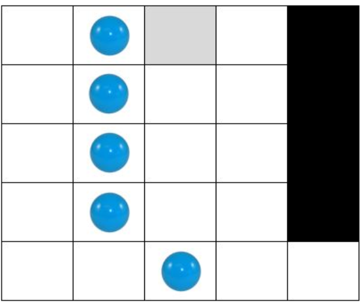
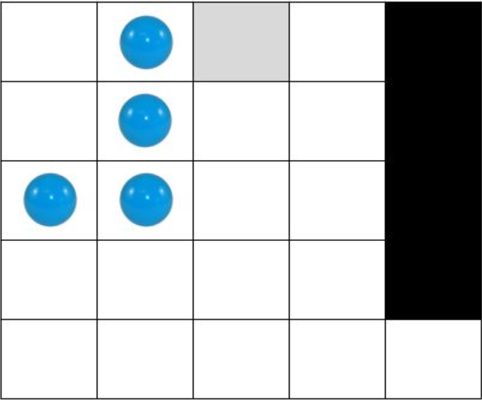
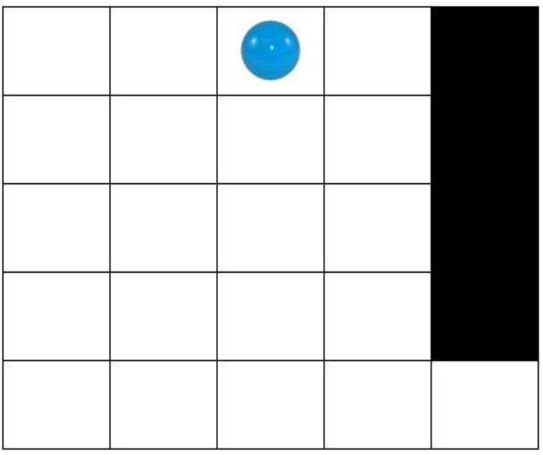

#Задача 1 - Солитер
Предложете соодветна репрезентација и напишете ги потребните функции во Python за да се реши следниот проблем за кој една можна почетна состојба е прикажана на следната слика

На табла со димензии N x N, каде N > 3 е непарен природен број, поставени се топчиња. Некои од полињата се неупотребливи т.е. во нив никогаш не може да се поставуваат топчиња (на Слика 1 ваквите полиња се обоени со црна боја). Топчињата не се разликуваат помеѓу себе. Со избор (кликнување) на кое било топче може да се направи преместување на тоа топче од полето во кое се наоѓа -> преку едно поле (во една од шесте насоки: горе-десно, горе-лево, долу-десно, долу-лево, лево или десно), но само ако „прескокнатото“ поле содржи друго топче и полето до „прескокнатото“ поле (во соодветната насока) е слободно. Притоа, „прескокнатото“ топче исчезнува т.е се отстранува од таблата. На пример, со кликнување на топчето кое се наоѓа во петтата редица и третата колона на таблата прикажана на Слика 1, топчето кое се наоѓа во полето горе-лево од него ќе исчезне, а кликнатото топче ќе се позиционира во полето што се наоѓа во третата редица и првата колона (види ја Слика 2!).

Не е дозволено топчињата да излегуваат од таблата. Целта е на таблата да остане точно едно топче кое ќе биде позиционирано во централното поле во првата редица, како што е прикажано на Слика 3. Потребно е проблемот да се реши во најмал број на потези т.е. со избирање (кликнување) на најмал можен број на топчиња.

За сите тест примери обликот на таблата е ист како на примерот даден на Слика 1. За секој тест пример се менува големината N на таблата, како и бројот и распоредот на топчиња и неупотребливи полиња, соодветно. На влез прво се чита должина и ширина на просторот. Потоа се чита бројот на топчиња. Во наредните линии се читаат позициите на топчињата. На крај се читаат бројот на препреките и во наредна линија позиција на препрека.

Движењата на топчињата (потезите) потребно е да ги именувате на следниот начин: GoreLevo: (x: x_val, y: y_val) - за преместување во насока горе-лево на топчето кое се наоѓа во x координатата x_val и y координатата y_val (ако таблата ја гледате во стандардниот координатен систем) GoreDesno: (x: x_val, y: y_val) - за преместување во насока горе-десно на топчето кое се наоѓа во x координатата x_val и y координатата y_val (ако таблата ја гледате во стандардниот координатен систем) DoluLevo: (x: x_val, y: y_val) - за преместување во насока долу-лево на топчето кое се наоѓа во x координатата x_val и y координатата y_val (ако таблата ја гледате во стандардниот координатен систем) DoluDesno: (x: x_val, y: y_val) - за преместување во насока долу-десно на топчето кое се наоѓа во x координатата x_val и y координатата y_val (ако таблата ја гледате во стандардниот координатен систем) Levo: (x: x_val, y: y_val) - за преместување налево на топчето кое се наоѓа во x координатата x_val и y координатата y_val (ако таблата ја гледате во стандардниот координатен систем) Desno: (x: x_val, y: y_val) - за преместување надесно на топчето кое се наоѓа во x координатата x_val и y координатата y_val (ако таблата ја гледате во стандардниот координатен систем).

Тест пример: 5 3 2,0 1,1 1,3 4 4,1 4,2 4,3 4,4