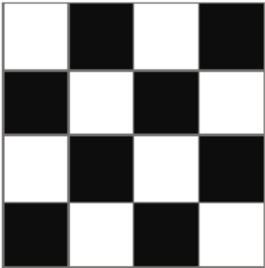
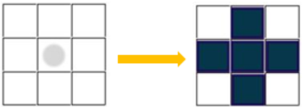

# Задача 3 - Црно бело
Предложете соодветна репрезентација и напишете ги потребните функции во Python за да се реши следниот проблем за кој една можна почетна состојба е прикажана на Слика 1:

Tабла со димензии N x N се состои од бели и црни полиња. Со избор (кликнување) на едно поле се прави промена на бојата на тоа поле и на сите негови непосредни соседи (горе, долу, лево и десно) во спротивната боја, како што е прикажано на Слика 2. Целта е сите полиња на таблата да бидат обоени во црна боја. Потребно е проблемот да се реши во најмал број на потези т.е. со избирање (кликнување) на најмал можен број на полиња.

За сите тест примери обликот на таблата е ист како на примерот даден на Слика 1. За секој тест пример се менува големината N на таблата, како и распоредот на црни и бели полиња на неа, соодветно.

Во рамки на почетниот код даден за задачата се вчитуваат влезните аргументи за секој тест пример. Во променливата n ја имате големината на таблата (бројот на редици односно колони); во променливата fields ја имате бојата на сите полиња на таблата (по редослед: одлево - надесно, редица по редица, ако таблата ја гледате како матрица), каде 1 означува дека полето е обоено во црна, а 0 означува дека полето е обоено во бела боја.

Изборот на полиња (потезите) потребно е да ги именувате на следниот начин:

x: redica, y: kolona

каде redica и kolona се редицата и колоната на избраното (кликнатото) поле (ако таблата ја гледате како матрица).

Вашиот код треба да има само еден повик на функција за приказ на стандарден излез (print) со кој ќе ја вратите секвенцата на потези која треба да се направи за да може сите полиња на таблата да бидат обоени во црна боја. Треба да примените неинформирано пребарување. Врз основа на тест примерите треба самите да определите кое пребарување ќе го користите.