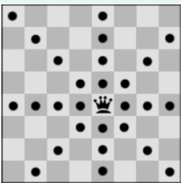

Дадена е nxn табла за шах. Треба да се постават n кралици на таблата така што ниедна кралица да не се напаѓа. Кралиците може да се постават на било која позиција која сметаме дека е најсоодветна. Единственото ограничување е дека не треба да се напаѓаат. Можните придвижувања на кралицата ви се дадени на сликата подолу:

На влез се прима бројот на кралици и димензии на таблата n. На излез треба да се испечати бројот на уникатни позиции на кои може да ги поставете кралиците со default Backtracking Solver ако бројот на кралици е помал или еднаков на 6. Во спротивно да се испечати само првото решение.

Потсетник: Во дадениот модул constraint веќе се имплементирани следните ограничувања како класи:  AllDifferentConstraint, AllEqualConstraint, MaxSumConstraint, ExactSumConstraint,  MinSumConstraint, InSetConstraint, NotInSetConstraint, SomeInSetConstraint,  SomeNotInSetConstraint.