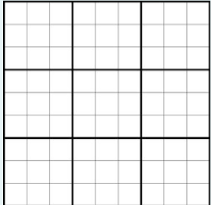

Дадена ви е играта судоку. Во оваа игра во секој блок се ставаат бројки од 1 до 9 така што во ниедна редица, колона и блок не смее да се повторува ниедна цифра. Почетно сите полиња се празни. Вашата задача е да најдете решение на овој проблем. Просторот ви е даден на сликата подолу.

**Забелешка:** На влез добивате со каков `Solver` да работите. Испечатете го само првото решение. **Не е задолжително да ви поминуваат сите тест примери за задачата да биде точна. Зависи како сте ги поставиле условите.**

Потсетник: Во дадениот модул constraint веќе се имплементирани следните ограничувања како класи:  AllDifferentConstraint, AllEqualConstraint, MaxSumConstraint, ExactSumConstraint,  MinSumConstraint, InSetConstraint, NotInSetConstraint, SomeInSetConstraint,  SomeNotInSetConstraint.