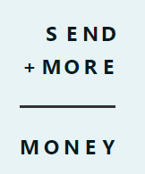

SEND+MORE=MONEY е криптоаритметичка загатка, што значи дека станува збор за наоѓање цифри кои ги заменуваат буквите за да се направи математичкиот израз вистинит. Секоја буква во проблемот претставува една цифра (0–9). Две букви не можат да ја претставуваат истата цифра. Кога буквата се повторува, тоа значи дека цифрата се повторува во решението. 

Даден е почетен код со кој е креирана класа за претставување на проблемот, на кој се додадени променливите со нивниот домен. Потоа се повикува наоѓање на решение со BacktrackingSolver. Ваша задача е да го/ги додадете ограничувањето/њата (условите) на проблемот.

Потсетник: Во дадениот модул constraint веќе се имплементирани следните ограничувања како класи:  AllDifferentConstraint, AllEqualConstraint, MaxSumConstraint, ExactSumConstraint,  MinSumConstraint, InSetConstraint, NotInSetConstraint, SomeInSetConstraint,  SomeNotInSetConstraint.