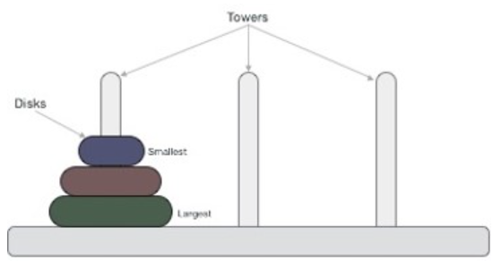

# Задача 2 - Кулите на Ханој
Во серија се наредени N кружни столбови со иста висина. На почетокот, на само еден од столбовите наредени се M камени блокови во форма на крофни со различна големина. Блоковите се наредени како кула т.н. најголемиот блок е поставен најдоле на столбот, а секој блок после него е помал од својот претходник подолу.

Крајната цел е кулата од почетниот столб да се премести на некој друг столб т.ш. ќе биде запазен оригиналниот редослед на блоковите.

Ваша задача е преку техниката на неинформирано пребарување низ простор на состојби да одредите кој е најмалиот број на чекори потребни да се пресметат блоковите од почетниот столб до крајниот т.ш. важи правилото дека во секој чекор само еден блок од врвот на некој столб може да се помести на некој друг столб ако е помал од блокот на врвот на другиот столб или другиот столб е празен. Во почетниот код дадено ви е читањето од стандарден влез на почетната и целната состојба на столбовите, т.ш. секој столб е претставен со посебна торка а броевите ги означуваат големините на блоковите. На стандарден излез испечатете го минималниот број на потребни чекори да се реши проблемот како и редоследот на потребните акции кои се во форматот MOVE TOP BLOCK FROM PILLAR i TO PILLAR j.