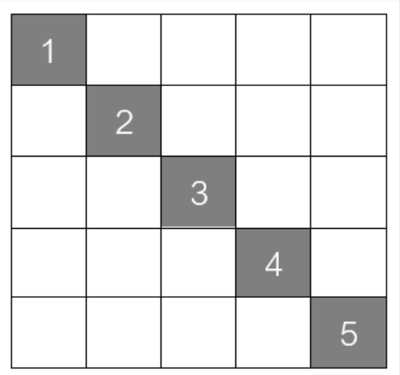

Дадена е табла 5x5, каде што се поставени 5 сиви квадратчиња. На почетокот 5те квадратчиња се поставени на случајни позиции во таблата. Секое од квадратчињата има реден број, кој што одредува на кое поле по левата дијагонала на таблата е потребно да се намести даденото квадратче. Пример на почетна состојба на таблата е даден на слика 1, додека слика 2 ја прикажува состојбата на таблата која е целна. Секое од квадратчињата може да се помести во четири насоки: горе, долу, лево и десно за една позиција. Со еден потег може да се помести само едно црно квадратче, и притоа квадратчето не смее да се помести надвор од таблата, а на едно исто поле може да се најдат повеќе квадратчиња.  

Слика 1:
Initial state

Слика 2:
Goal state

За сите тест примери големината на таблата е иста, а позицијата на секоја од квадратчињата се чита од стандарден влез. Ваша задача е да го имплементирате поместувањето на квадратчињата во successor функцијата, така што најпрво ќе се проба акцијата за поместување на првото квадратче горе, долу, лево и десно, потоа на второто, третото, четвртото и петтото по тој редослед. Акциите се именуваат како „Pomesti kvadratche X levo/desno/gore/dolu“. Проверката дали состојбата е валидна е веќе имплементирана со функцијата check_valid и може да си ја искористите директно, не треба ништо друго да имплементирате! Состојбата на проблемот се чува во торка каде што елементите се x и y позициите на секое од квадратчињата, претставени редоследно според бројот кој го претставуваат (на прва позиција е квадратчето со број 1, на втора позција е квадратчето со број 2, итн.). На пример, почетната состојба на слика 1 би била ((2, 4), (3, 1), (4, 1), (1, 2), (0, 0)). 